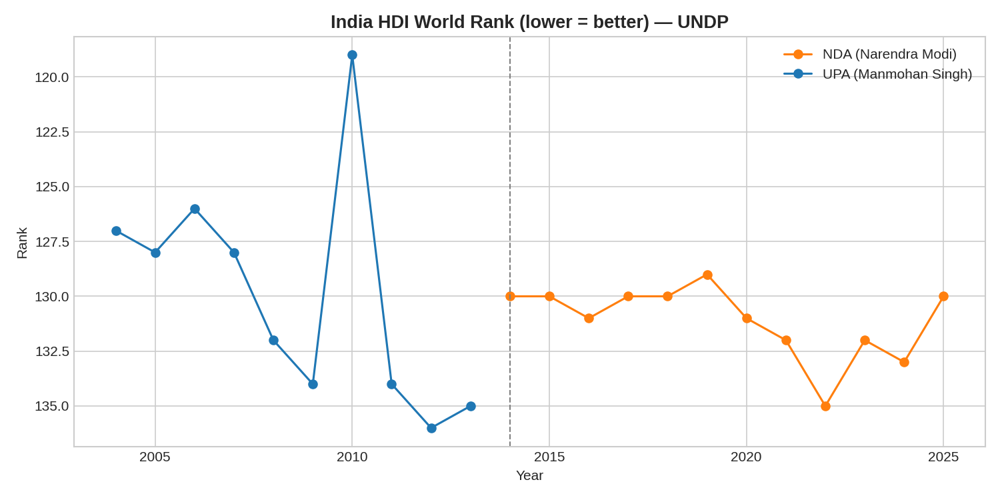
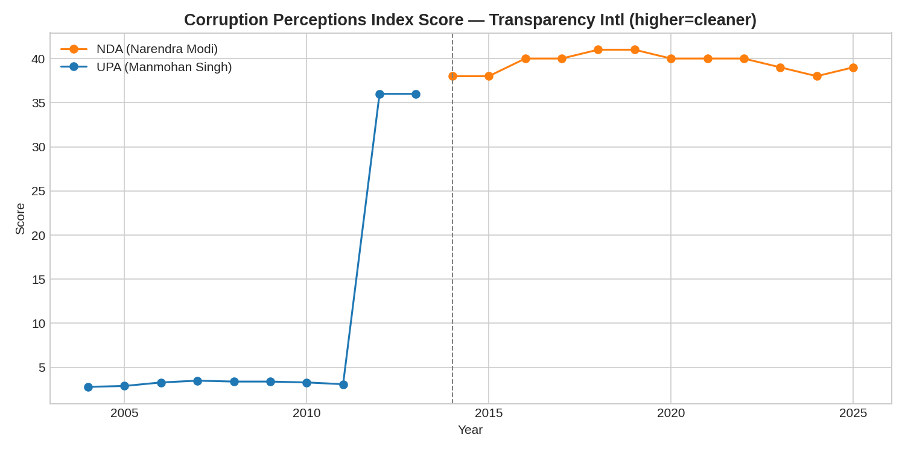
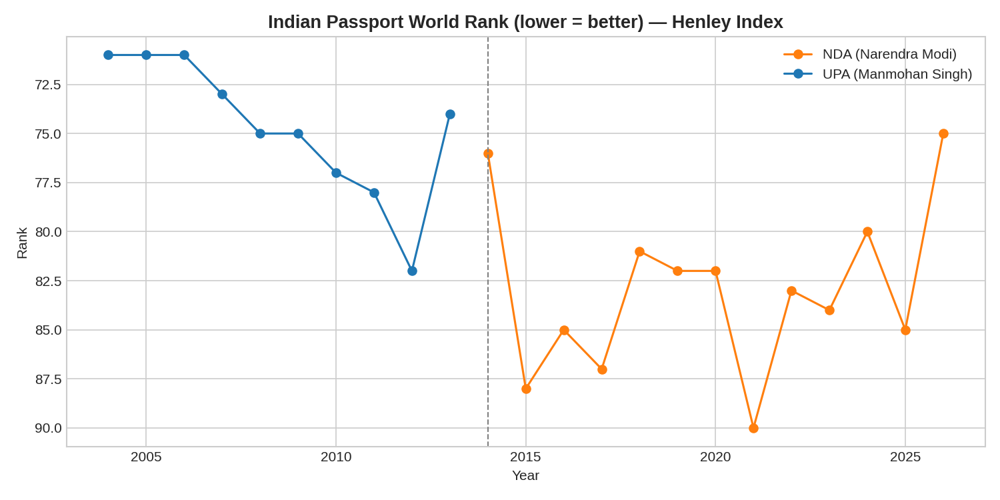
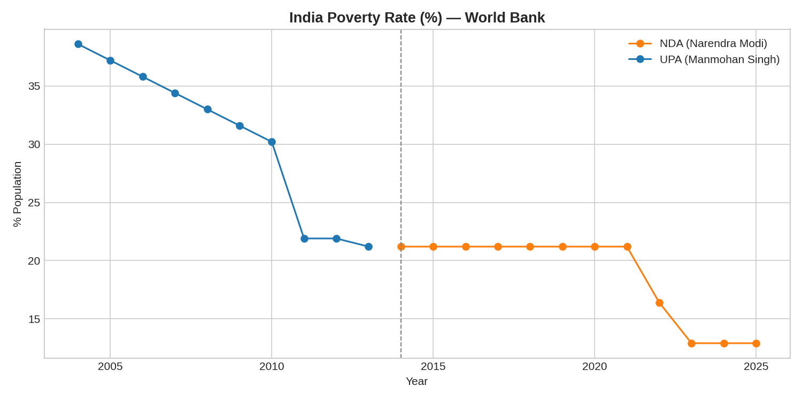
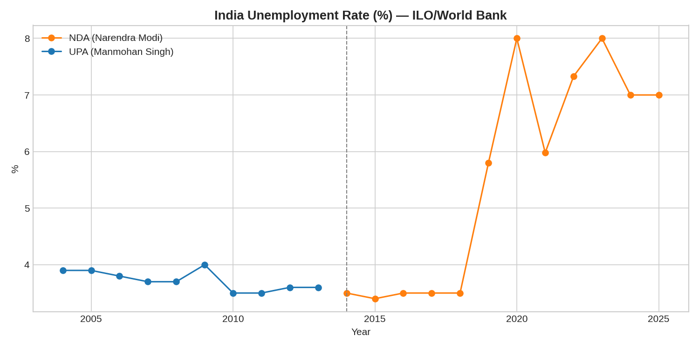
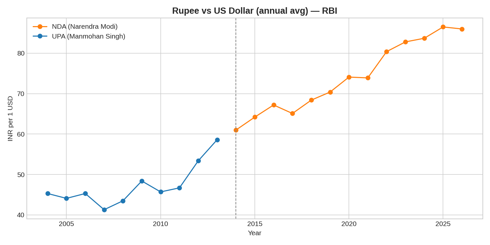
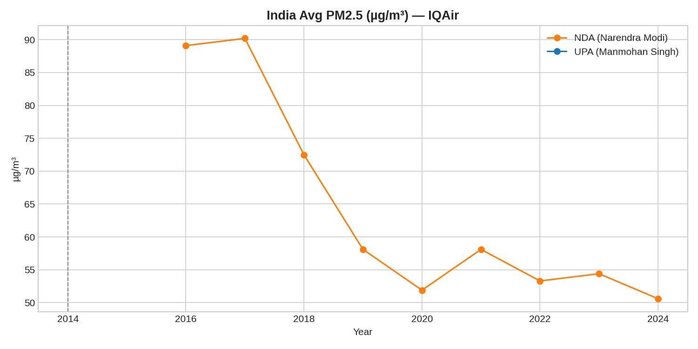
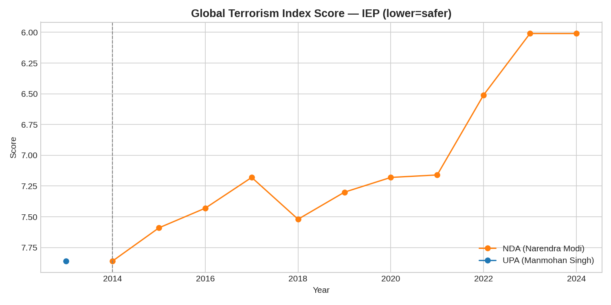

# India Global Rankings Dataset (2004–2026)
## UPA Era (Manmohan Singh, 2004–2014) vs NDA Era (Narendra Modi, 2014–2026)

## Sources (each is the globally-recognized, primary publisher for that index)
| Indicator | Publisher | Website |
|---|---|---|
| Human Development Index (HDI) | UNDP – Human Development Report Office | hdr.undp.org |
| Poverty Rate (% below national/international poverty line) | World Bank (Poverty & Inequality Platform) | data.worldbank.org |
| Unemployment Rate | ILO Modelled Estimates / World Bank / CMIE | ilo.org, data.worldbank.org |
| Corruption Perceptions Index (CPI) | Transparency International | transparency.org |
| Global Terrorism Index (GTI) | Institute for Economics & Peace (IEP) | visionofhumanity.org |
| Press Freedom Index | Reporters Without Borders (RSF) | rsf.org |
| Air Quality (PM2.5 µg/m³, pollution) | IQAir World Air Quality Report | iqair.com |
| Henley Passport Index | Henley & Partners (IATA data) | henleyglobal.com |
| INR vs USD exchange rate (annual average) | Reserve Bank of India (RBI) | rbi.org.in |

## Important Methodology Notes (read before presenting this as "100% precise")
1. **CPI scale change**: Transparency International used a 0–10 scale until 2011 and switched to a 0–100 scale from 2012 onward. Both are shown as originally published — do not directly compare a 2010 score to a 2015 score without rescaling.
2. **GTI was first published in 2012** (covering data from 2002), so no GTI rank exists for India before 2012/2013 in this file.
3. **HDI values are restated** by UNDP almost every year (methodology/goalpost revisions), so the "rank" for, e.g., 2010 published today differs slightly from the rank published in the original 2010 report. We use the most recently restated series for consistency — this is UNDP's own recommended practice.
4. **Poverty rate** is based on India's last full consumption surveys (2004–05, 2011–12) and the World Bank's nowcasts/PLFS-based estimates for later years; India does not publish an official poverty line update every year, so 2012–2024 uses World Bank modelled/nowcast figures.
5. **2026 row** is a partial/in-progress year (data through June 2026) — many indices (HDI, CPI, GTI) had not yet published a 2026 edition at the time of writing.
6. Cells left blank indicate no verified published figure exists for that year/index.

## Files in this package
- `india_rankings_2004_2026.csv` — master dataset (also embedded in Excel/SQL)
- `India_Rankings_Analysis.xlsx` — Excel workbook: raw data + UPA vs NDA summary + charts
- `india_rankings.db` — SQLite database (queryable via SQL)
- `analysis.py` — Python (pandas/matplotlib) script that reproduces all charts from the .db
- `charts/` — PNG chart exports (for GitHub README / LinkedIn post)
- `India_Rankings_Presentation.pptx` — ready-to-present PPT deck
- `README.md` — this file

## Python Analysis (matplotlib)
Static charts generated directly from the SQLite database using pandas + matplotlib — see `analysis.py`.

### HDI Rank (UNDP) — UPA vs NDA

### Corruption Perceptions Index (Transparency International)

### Passport Power (Henley Index)

### Poverty Rate (World Bank)

### Unemployment Rate (World Bank/ILO)

### Rupee vs Dollar (RBI)

### Pollution / PM2.5 (IQAir)

### Terrorism Impact (IEP)

## Power BI Dashboard

Interactive dashboard (.pbix) available in this repo — open with Power BI Desktop (free) to explore.

